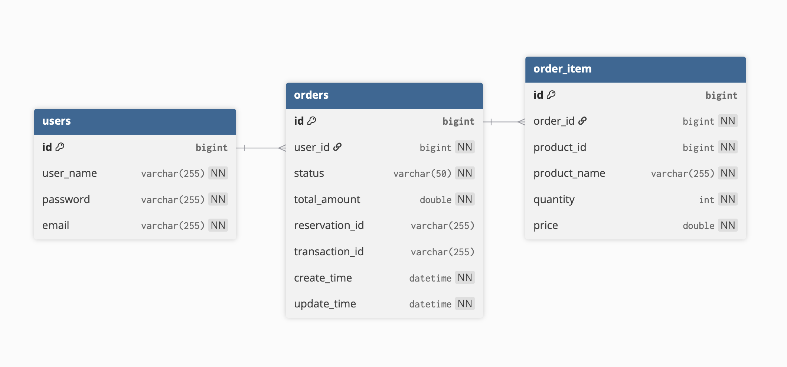

# COMP5348 Group Project Report

## Section 1: Introduction

### 1.1 Overview of the Store System

The Store application is an online platform that allows customers to buy physical products. It follows a microservice architecture and works together with four key services: Warehouse, Bank, DeliveryCo, and EmailService.

Customers can log in, place orders, track deliveries, and receive email updates. Each order goes through several steps including stock check, payment, delivery coordination, and status notification.

### 1.2 Key Features and Responsibilities

The Store system coordinates important tasks during the shopping process:
a. It checks stock levels across multiple warehouses before confirming orders.
b. It sends payment requests to the Bank service and handles refunds when needed.
c. It requests delivery from DeliveryCo and listens for delivery status updates.
d. It sends email notifications through EmailService when orders succeed or fail.

### 1.3 Design Goals

To support real-world demands, the system is built with the following goals:
a. High Availability: The system keeps working even if some services are down.
b. Fault Tolerance: If a step fails (like payment or delivery), the system can roll back or fix it automatically.
c. Asynchronous Communication: The system uses RabbitMQ to send messages between services, which helps reduce delays and makes the system more flexible.

## Section 2: System Architecture Overview

### 2.1 Overall Design

The Store system is built using microservices. Each service has a specific job and communicates with others using REST APIs or asynchronous messaging via RabbitMQ.

This separation makes the system easier to manage, test, and scale. It also improves fault isolation and flexibility when updating or adding new features.

### 2.2 Component Interactions

The platform includes five key services:

   a. Store Service: Handles login, order creation, payment, delivery, and user notifications.

   b. Warehouse Service: Checks if products are in stock and manages inventory for each warehouse.

   c. Bank Service: Manages user balances and processes payments and refunds.

   d. DeliveryCo: Delivers orders and sends delivery status updates.

   e. EmailService: Sends emails to users about order status or problems.

A normal order process includes the following steps:

   a. The Store checks stock with Warehouse.

   b. If stock is available, it sends a payment request to Bank.

   c. After payment, it sends a delivery request to DeliveryCo.

   d. The Store then waits for delivery status updates and sends emails through EmailService.

### 2.3 Layered Architecture Inside Each Service

Each microservice follows a layered structure:

   a. Controller Layer: Receives API requests and sends responses.

   b. Service Layer: Contains business logic like stock validation or payment handling.

   c. Mapper Layer: Handles database access (using MyBatis-Plus).

   d. Entity/DTO Layer: Defines the data model for saving or transferring data.

This structure keeps logic separate, which helps with testing and future changes.

## Section 3: Key Features and Workflows

### 3.1 User Authentication

#### 3.1.1 Overview of the Login Flow

User login starts with basic input validation to ensure both username and password are provided. The controller then delegates the request to the service layer, which handles all authentication logic. This clear separation keeps the web layer simple and improves maintainability. If the user does not exist in the database, a consistent error response is returned, allowing the frontend to display proper feedback. This structure promotes a clean and predictable login flow.

#### 3.1.2 Secure Password Handling

To protect user credentials, the system stores passwords as hashed values instead of plain text. When users log in, their input passwords are hashed and compared with the stored hash. This prevents sensitive data from being exposed. Additionally, the system avoids logging any password data, following secure coding practices that reduce the risk of accidental leaks or misuse in logs or API responses.

#### 3.1.3 Token Generation and Structure (JWT)

Upon successful login, the system issues a JSON Web Token (JWT) that contains key user details like ID and username. The token is signed using a secret key and includes an expiry time, both configured in the system settings. It is returned to the frontend in a consistent response format, making it easy to handle in the client code for future requests to authenticated endpoints.

#### 3.1.4 Frontend Token Usage and Stateless Design

The frontend stores the JWT in local storage, allowing the user to remain logged in across page reloads. For protected API requests, the token is attached in the Authorization header using the Bearer format. Since the backend does not store session state, logging out is as simple as clearing the token. This stateless design supports scalability, as any backend instance can validate tokens without relying on shared session data.

#### 3.1.5 Reliability and Separation of Concerns

Authentication is designed to be stable and modular. Inputs are always validated, and errors are returned in a structured format. Utility classes handle password encryption and token generation, separating them from the business logic. This modularity makes the system easier to test, extend, and deploy across different environments without major changes to the code structure.

#### 3.1.6 Summary

The authentication flow in the Store microservice is secure, stateless, and scalable. It uses hashing to protect passwords, JWTs for sessionless login, and clearly separates concerns across layers. This makes it suitable for modern distributed systems and allows future upgrades without disrupting the existing design.
### 3.2 Order Placement and Fulfillment

#### 3.2.1 Request Handling and Domain Structure

When the frontend submits an order, the controller forwards it to the service layer. The system stores each order and its items as separate records in the database. To prevent exposing internal data, it uses DTOs to carry request and response information between the frontend and backend. This keeps internal models clean and ensures only necessary data is shared. The design follows a clear layered structure, separating concerns and making the system easier to maintain and extend in the future.

#### 3.2.2 Inventory Validation with Warehouse

Before saving the order or taking payment, the Store checks if stock is available by sending a validation request to the Warehouse service. If stock is not enough, the system logs the failure, stops processing, and notifies the customer. If the check passes, it calculates how much stock to reserve from each warehouse. This is done before writing anything to the database, ensuring accurate stock tracking and consistent coordination between services in a distributed setup.

#### 3.2.3 Stock Reservation and Payment Process

Once stock is confirmed, the system creates the order and marks it as “pending payment.” It reserves the needed stock and then calls the Bank service to deduct the payment. If the debit is successful, the transaction ID is saved in the order record. Although earlier documents claimed payment comes before reservation, the real design reserves stock first, then processes payment. This order helps avoid over-selling but requires careful rollback if payment fails, which the system handles gracefully.

#### 3.2.4 Handling Failures and Rollbacks

If payment or stock validation fails, the system releases reserved stock, marks the order as failed, and notifies the user. If payment succeeds but a later step fails, a refund is triggered, stock is released, and order status is updated. Manual cancellations follow similar logic with ownership checks and refunds if needed. Each step runs in its own transaction, allowing clean recovery without affecting other processes, and making sure no inventory or funds remain stuck after a failure.

#### 3.2.5 Delivery and Fulfillment via Messaging

After payment, a delivery request is sent to RabbitMQ. This event-driven method allows delivery to run separately from the main order system. Delivery updates like “picked up” or “delivered” are received asynchronously and used to update order status. If a delivery is lost, the system automatically starts a refund. During this whole process, email notifications are sent without blocking the order flow, making sure users are informed while keeping the system responsive.

#### 3.2.6 Reliability and Robustness

All key steps—creating orders, reserving stock, processing payment, and sending delivery—run in separate transactions. This prevents errors in one step from affecting the rest. While stock is reserved before payment, any payment failure triggers a rollback that cleans up reserved inventory and updates the order. Each failure point has error-handling logic that performs safe actions like refunds or stock release. RabbitMQ is used for communication, allowing retries during temporary failures and improving system resilience.

#### 3.2.7 Summary

The Store service handles orders through a clear process of validation, reservation, payment, and delivery. Although stock is reserved before payment, all operations are isolated with strong rollback logic to keep data accurate. The design uses asynchronous messaging, separate transactions, and structured error handling to provide a stable and scalable system for order fulfillment.

### 3.3 Payment Processing

#### 3.3.1 Bank Integration

The Store service does not handle any monetary operations directly. Instead, it sends debit and refund requests to the Bank microservice. This communication is done using a REST client. When a customer places an order, the Store builds a payment request that includes the order ID, user ID, amount, and currency. The Bank processes this request and returns a response that confirms whether the payment was successful or not. This clear separation keeps financial operations isolated from the order logic.

#### 3.3.2 Recording Payment Results

If the payment is successful, the Store updates the order status to show that payment was completed. It also saves the transaction ID and total amount into the order record. This ensures that every order has a complete and traceable payment history. These details can be used later for customer support, reporting, or refund handling.

#### 3.3.3 Handling Payment Failures

When the Bank fails to process the payment, the Store takes quick action. It releases the reserved stock to prevent holding inventory for an unpaid order. The system also marks the order as failed and returns an error message to the user. This avoids confusion and ensures that the system stays in a consistent state even when the payment cannot be completed.

#### 3.3.4 Triggering Refunds

Refunds are issued when a paid order cannot be fulfilled. This may happen if a customer cancels the order or if delivery fails. In such cases, the Store prepares a refund request using the same details as the original payment. This helps keep all financial actions linked and consistent.

#### 3.3.5 Executing Refunds Safely

To avoid double refunds, the system adds an idempotency key to each refund request. This key uses a clear format such as REFUND-<orderId>. If the refund process is retried for any reason, this key ensures that the same refund is not processed twice. After the Bank confirms the refund, the system continues with any follow-up actions like updating the order status and notifying the user.

#### 3.3.6 Error Logging and Notifications

When a refund fails, the system logs the error and sends an alert to the support team. This allows human operators to step in and resolve the issue manually. All refund attempts are recorded in the logs for later review. If the refund is successful, a notification is sent to the customer using the asynchronous messaging system, helping the user stay informed.

#### 3.3.7 Consistency and Safety

The Store uses the order ID and idempotency key to keep payment and refund records consistent. These values are used in both Store and Bank systems to ensure they always match. Each payment and refund action is handled in its own transaction, which keeps changes separate and recoverable. This reduces the chance of data loss or corruption if a step fails.

#### 3.3.8 Summary

In summary, the Store’s payment system is designed to be reliable, traceable, and safe. By separating concerns, using strong identifiers, and isolating each financial step, the system supports secure and auditable operations across multiple services.

### 3.4 Delivery Process

#### 3.4.1 Triggering Delivery

After a customer successfully completes a payment, the system starts the delivery process. The Store service sends a delivery request message to RabbitMQ. This message is created from the order details and contains all the needed delivery information. The delivery process begins without waiting for a response, keeping the order and payment parts separate from logistics.

#### 3.4.2 Preparing the Delivery Request

The delivery request includes important details such as the order ID, customer ID and email, a list of warehouse locations, and all the products in the order. Each product record shows its ID, name, quantity, and the warehouse it is stored in. This rich information helps the delivery service process the shipment correctly and plan its route.

#### 3.4.3 Receiving Delivery Updates

The delivery partner sends updates about the order through RabbitMQ. These updates arrive as messages and are handled by a background listener inside the Store service. The listener receives the status update and tells the service to change the order’s delivery status. Because this process is asynchronous, it does not block or slow down the system.

#### 3.4.4 Mapping Status to Order Progress

The delivery status can be one of several stages: the request has been received, the items have been picked up, they are on the way, they have been delivered, or they are lost. Every time the status changes, the system updates the order record and adds a timestamp. This gives users and administrators a full timeline of the delivery.

#### 3.4.5 Handling Lost Shipments

If the delivery partner reports that the package is lost, the system automatically takes action. It begins a refund process for the customer, sends a refund notification, and marks the order as lost. This prevents the order from being processed further and keeps the customer informed. This way, even when something goes wrong, the system reacts quickly and protects the user experience.

#### 3.4.6 Sending Notifications

Email notifications are sent when deliveries fail or refunds are made. These emails are triggered by helper methods and are delivered through RabbitMQ. By sending messages instead of direct emails, the system avoids delays and stays fast, even when the email service is slow or busy.

#### 3.4.7 Architectural Strengths

The delivery process is fully event-driven. It works independently of order placement and payment, which makes the system more flexible. If one part fails, the other parts can still continue. This design improves the ability to scale, keeps services loosely connected, and ensures that the system stays responsive even when many deliveries are being handled at the same time.

#### 3.4.8 Summary

In conclusion, this message-based delivery approach helps the system stay reliable, recover from failures easily, and provide a smooth shopping experience for users.

### 3.5 Email Notifications

#### 3.5.1 Notification Triggers

The system sends email notifications when important events occur. These include order failures due to stock issues, payment problems, or service downtime. Refunds, whether from cancellations or delivery failures, also trigger an email. If a package is lost, the system both refunds the customer and notifies them through email. These notifications are created by service layer methods that handle messaging in a consistent and traceable way.

#### 3.5.2 Asynchronous Email Dispatching

The Store service does not send emails directly. Instead, it creates and sends a message to RabbitMQ. This message contains all the information needed for the email, and it is picked up later by the EmailService. Because the system does not wait for the email to be sent, it stays fast and responsive even during high load or email system delays.

#### 3.5.3 Structure of Notification Messages

The email messages follow a fixed structure. For order failures, the message includes the order ID, customer email, and a short explanation of why the order failed. For refunds, the message includes the amount, the time of the refund, and the reason. These details help the EmailService build a clear and useful email for the customer.

#### 3.5.4 Use of Helper Methods

The system uses helper methods to build and send notification messages. These methods collect all needed data, build the right message, and publish it to RabbitMQ. Because the logic is in one place, it is easy to reuse and maintain. This also ensures that emails are always sent in the same way, no matter what event triggered them.

#### 3.5.5 Clear Role Separation

The Store service is only responsible for publishing the email event. It does not handle the layout, formatting, or sending of the email itself. That is the job of the EmailService. This separation keeps each service focused and makes the system easier to change and scale in the future.

#### 3.5.6 System Benefits

Using asynchronous messaging brings several advantages. Even if the email system is slow or temporarily down, the messages are kept in a queue and not lost. The Store can continue processing orders without delay. Customers still get important updates in time, and support teams can monitor the message flow for any problems.

#### 3.5.7 Summary

In summary, this email notification design helps the system stay reliable and efficient. By using message queues and clear service boundaries, the Store delivers important updates without blocking order processing or slowing down the system.

### 3.6 Order Cancellation

#### 3.6.1 Cancellation Access and Conditions

The Store system allows customers to cancel orders through a dedicated API endpoint. Before processing the cancellation, the system verifies that the order exists, belongs to the user making the request, and has not yet reached a non-cancellable stage. Orders that have already begun delivery—such as those marked as picked up, in transit, or delivered—cannot be cancelled.

#### 3.6.2 Ownership and Status Validation

To protect user data and maintain system correctness, the service checks that the requesting user is the owner of the order. It also prevents duplicate or invalid cancellation attempts. If the order is already cancelled or has failed previously, the system blocks the action and returns a clear error message to the user interface.

#### 3.6.3 Restoring Inventory

If the order has reserved stock, the system ensures that inventory is released before finalising the cancellation. This is done by sending a request to the warehouse system to return the reserved products. This step guarantees that the Store and Warehouse services remain consistent with each other and prevents stock from being incorrectly locked.

#### 3.6.4 Payment Reversal

For orders that have already been paid, the system triggers a refund to the user’s account. The refund request includes all necessary details such as the order ID, user ID, amount, and currency. An idempotency key is included to make sure that no duplicate refunds occur, even if the system retries the request due to a timeout or temporary failure. If the refund is successful, the system continues the cancellation process. If the refund fails, the issue is recorded in logs, and the frontend is informed so support staff can follow up manually.

#### 3.6.5 Notification Handling

After a successful refund, the system sends a notification message to inform the customer. This message is passed to the EmailService using an asynchronous messaging system, which ensures that the refund operation does not slow down the overall cancellation process. The email includes key details like the refund amount and reason.

#### 3.6.6 Finalisation and Safety Measures

Once the stock is released and the refund is confirmed, the system marks the order as cancelled. This status change is saved to the database with a new timestamp. The full cancellation flow is designed with error handling and recovery in mind. Even if some external services are temporarily unavailable, the system is built to protect payment integrity, stock accuracy, and user communication.

#### 3.6.7 Summary

In conclusion, the Store’s cancellation process is carefully designed to balance user control with system stability. It prevents unsafe or duplicate cancellations, returns stock properly, manages refunds, and keeps the user informed. The entire process is reliable, secure, and well-integrated with other parts of the system.

### 4. Inter-Application Communication Design

#### 4.1 Messaging Topology

To support communication between services, the Store system uses RabbitMQ with a topic exchange pattern. Each message type is routed through a dedicated exchange. The delivery.exchange handles all delivery-related messages, while the store.exchange is used for user-facing notifications like order failures or refunds. Every message has a clear routing key and is delivered to exactly one queue. Importantly, each microservice owns its own queue. For example, the DeliveryCo service receives delivery requests through delivery.request.queue, and the EmailService listens to queues like email.orderfail.queue. This one-queue-per-service strategy avoids interference between services and helps keep the system stable and easier to scale.

#### 4.2 Publishers and Listeners

Messages are sent using a centralized publisher component inside the Store service. This component prepares the content and sends it to the correct exchange and routing key. The message data is formatted in JSON so that all services can read it easily without needing to know internal Java structures. Each message is received by a specific listener method inside the target service. For example, the Store listens for delivery updates and updates the order status based on the message content. Because only one service listens to each queue, this design helps prevent bugs and makes the system more reliable.

#### 4.3 Message Contracts

All messages follow a fixed structure so that both the sender and receiver understand the meaning of the data. For example, a delivery request includes the order ID, customer ID, and a list of items. A refund message includes the amount, reason, and timestamp. These message structures are written as DTOs (Data Transfer Objects) in the code, and are automatically turned into JSON when sent. This contract-based design makes it easier to debug and also helps other teams or services understand what kind of messages they can expect from the Store.

#### 4.4 Compensating Actions

When something goes wrong in another service, the Store does not stop working. Instead, it performs a compensating action to undo or fix the problem. For example, if the payment fails, the system will release any reserved stock. If the delivery is lost, the Store will trigger a refund and notify the user. These actions are done using messages as well, so they don’t block the main flow. This helps the system remain responsive even when some parts of it are having problems.

#### 4.5 Reliability Measures

To protect against data loss, all RabbitMQ queues and exchanges are marked as durable, meaning they survive service restarts. Each message includes a unique identifier, such as a refund key, to make sure the same action is not performed twice. If a message cannot be processed, it can be retried or moved to a dead-letter queue for later review. This setup ensures that even if something goes wrong, the system can recover and continue running safely.

#### 4.6 Scalability and Observability

Because each service has its own queue, services can scale independently. For example, if the EmailService becomes very busy, it can add more workers without affecting the Store or DeliveryCo. This design also helps teams monitor the system better, because each queue shows a clear view of what messages are waiting or failing. If new services are added in the future, they can easily join by creating a new queue and connecting it to the right routing key, without changing existing services.

#### 4.7 Protocol Selection Rationale

The Store system uses different communication protocols based on interaction patterns and quality requirements:

**REST APIs (Synchronous Communication):**
- Used for Bank and Warehouse service interactions where immediate response is required
- Chosen for its simplicity, statelessness, and widespread support in modern web services
- Preferred over SOAP due to lower overhead, easier debugging with JSON payloads, and better alignment with microservices principles
- Suitable for operations requiring immediate confirmation such as payment processing and stock validation

**RabbitMQ Message Queues (Asynchronous Communication):**
- Used for DeliveryCo and EmailService interactions where immediate response is not critical
- Provides reliability through durable queues, automatic retry mechanisms, and message persistence
- Enables service decoupling, allowing services to operate independently even when consumers are temporarily unavailable
- Supports event-driven architecture for non-blocking operations such as delivery status updates and email notifications

This hybrid approach balances request-response reliability (REST) with asynchronous resilience (messaging), ensuring both operational efficiency and system robustness. The protocol choice for each integration point is driven by whether the operation requires synchronous confirmation or can benefit from asynchronous processing.

#### 4.8 Summary

In summary, the system uses a well-structured messaging design where each microservice owns its own queue. This approach improves stability, allows each service to grow independently, and makes the overall system easier to maintain. It also ensures that communication between services is reliable and that errors can be handled gracefully without stopping the user experience.

## 5. Fault Tolerance and Availability

### 5.1 Overview of Fault Tolerance Strategy

The Store microservice maintains operational continuity through three core mechanisms: graceful degradation with compensating actions, comprehensive exception handling for different service failures, and automatic rollback to maintain data consistency. 

---

### 5.2 Failure Scenario 1: Bank Service Unavailable

#### 5.2.1 Scenario Description

This failure occurs when the Bank service is unavailable during payment processing, after stock has already been reserved. This is critical because inventory could remain locked while customers receive no feedback.

#### 5.2.2 Detection Mechanism

The system detects Bank service failures through network communication exceptions. When the payment request cannot reach the Bank service or receives error responses, the failure is immediately identified and triggers the recovery workflow.

#### 5.2.3 Compensating Actions

The system executes four automatic compensating actions:

1. **Release Reserved Stock**: Returns inventory to available pool for other customers
2. **Prevent Delivery**: Sends cancellation notification to delivery service
3. **Update Order Status**: Marks order as "FAILED" with immediate database commit
4. **Notify Customer**: Queues email notification explaining the failure

#### 5.2.4 Data Consistency

Since failure occurs **before** payment processing, no refund is required. The system ensures consistency across all components:

| Component | State After Failure | Result |
|-----------|---------------------|--------|
| Order Record | Status = "FAILED" | Preserved for audit |
| Warehouse | Stock released | Inventory available |
| Bank | No transaction | Customer not charged |
| Customer | Email sent | Informed to retry |

#### 5.2.5 Logging

All operations are logged with timestamps showing the complete failure sequence, enabling root cause analysis and customer support.

---

### 5.3 Failure Scenario 2: Package Loss by DeliveryCo

#### 5.3.1 Scenario Description

After successful payment and delivery request, DeliveryCo may lose packages (5% probability). This requires automatic refund processing since payment was already completed.

#### 5.3.2 Event-Driven Detection

The system uses asynchronous message listening to detect package loss:
- Continuously monitors delivery status update messages
- Identifies "LOST" status from delivery service
- Non-blocking, event-driven architecture
- Durable message queue ensures reliability

#### 5.3.3 Automated Recovery Workflow

Four-step recovery process:

1. **Validate Order State**: Verifies order exists and can process loss event

2. **Automatic Refund with Idempotency**:
   - Sends refund request to Bank service
   - Uses unique identifier to prevent duplicate refunds
   - Protected against message redelivery

3. **Update Order Status**: Changes to "LOST" with precise timestamp

4. **Email Notification**: Queues refund details for customer notification

#### 5.3.4 Idempotency Protection

The idempotency mechanism ensures:
- Duplicate status messages don't cause double refunds
- Bank service rejects duplicate refund requests
- Financial accuracy maintained during retries
- No business risk from message redelivery

#### 5.3.5 Data Integrity

Post-loss state across services:

| Component | Final State | Note |
|-----------|-------------|------|
| Order | Status = "LOST" | Complete audit trail |
| Bank | Refund completed | Balance restored |
| Warehouse | Stock decremented | Cannot return shipped items |
| Customer | Refund notification sent | Informed of resolution |

**Stock Not Returned**: Physical items were already shipped and lost, matching real-world inventory management.

#### 5.3.6 Logging

Structured logs track the complete recovery timeline from loss detection through refund completion, supporting monitoring and auditing requirements.

---

### 5.4 Failure Scenario 3: Order Processing Timeout (Proactive Rollback)

#### 5.4.1 Scenario Description

This failure scenario addresses a critical but often overlooked problem: when external services hang or respond extremely slowly **without throwing exceptions**, orders become "stuck" in intermediate states. Unlike explicit service failures, these "silent failures" don't trigger exception handlers but still lock resources indefinitely.

This represents a **proactive fault tolerance approach** rather than reactive exception handling, demonstrating advanced system monitoring and self-healing capabilities.

#### 5.4.2 Detection Mechanism

The system uses scheduled background monitoring to actively detect stalled orders:

**Monitoring Strategy:**
- Periodic scanning every **5 seconds** to check order processing states
- Examines all orders in intermediate states: validating, awaiting payment, or pending delivery
- Calculates time elapsed since last status update
- Triggers automatic rollback when elapsed time **exceeds 15 seconds**

This detection is fundamentally different from Scenarios 1 and 2:
- **Scenario 1 & 2**: Exception-driven (reactive)
- **Scenario 3**: Time-driven (proactive)

#### 5.4.3 Stage-Aware Rollback Strategy

The rollback logic intelligently adapts based on order progression stage:

**1. Timeout Before Payment**:
- **Action**: Release reserved stock only
- **Status Update**: Change to "CANCELLED"
- **Notification**: Timeout explanation sent to customer
- **No Refund**: Payment was never processed
- **Use Case**: Warehouse service hanging during stock check

**2. Timeout After Payment**:
- **Action**: Initiate automatic refund + release stock
- **Idempotency Protection**: Uses unique identifier to prevent duplicate refunds
- **Status Update**: Change to "CANCELLED"
- **Notification**: Refund notification sent to customer
- **Use Case**: Delivery service hanging after payment completed

#### 5.4.4 Key Benefits and Innovation

**Resource Protection:**
- Prevents indefinite inventory locking when services hang
- Ensures customer funds are returned promptly if order can't complete
- Maintains database cleanliness (no perpetual "processing" orders)

**Proactive vs Reactive:**
- Most systems only handle explicit failures (exceptions)
- This mechanism catches implicit failures (service degradation, hangs)
- Complements exception handling for comprehensive coverage

**System Observability:**
- Timeout patterns reveal slow/degraded services before complete failure
- Enables early intervention for performance issues
- Supports SLA monitoring through defined timeout threshold

#### 5.4.5 Logging and Monitoring

Structured logs track timeout detection and recovery, enabling performance analysis to identify which services frequently timeout, capacity planning to detect overloaded services, and customer support explanations for auto-cancelled orders.

---

### 5.5 Additional Resilience Mechanisms

#### 5.5.1 Other Failure Scenarios Handled

The system also handles additional failure scenarios through similar compensating action patterns:
- **Database Failures**: Complete rollback when database becomes unavailable
- **Message Queue Failures**: REST-based rollback when messaging system fails
- **Warehouse/Delivery Service Unavailable**: Service-specific compensating actions

#### 5.5.2 Durable Messaging Infrastructure

Message queue configuration ensures reliability:
- All queues and exchanges marked as persistent
- Messages survive system restarts without data loss
- Enables asynchronous communication without blocking operations

#### 5.5.3 Transaction Isolation

Independent transaction boundaries for critical updates:
- Status changes committed immediately in separate transactions
- Ensures concurrent queries see updated state instantly
- Prevents cascading failures across operations

#### 5.5.4 Comprehensive Logging

Structured logging strategy provides:
- Step-by-step operation tracking with timestamps
- Complete transaction history for auditing
- Full error details for debugging
- Support for monitoring and alerting systems

---

### 5.6 Summary

The Store microservice implements comprehensive fault tolerance through three major failure scenarios and supporting resilience mechanisms:

**Three-Tiered Failure Handling:**
1. **Reactive Exception Handling**: Bank and Warehouse service failures (Scenarios 1 & 2)
2. **Event-Driven Recovery**: Package loss detection and automatic refund (Scenario 2)
3. **Proactive Monitoring**: Timeout detection and auto-rollback (Scenario 3)

This multi-layered approach ensures the system handles both explicit failures (exceptions) and implicit failures (service degradation), providing robust fault tolerance through specific exception handling, automatic compensating actions, durable messaging, idempotency protection, and comprehensive logging. The design balances availability, consistency, and user experience, ensuring graceful handling of real-world distributed failures while maintaining data integrity across all services.

### 6. Quality Attributes and Trade-Offs

The Store microservice is designed to prioritize key software qualities such as availability, reliability, modularity, and extensibility. These qualities are achieved through specific architectural decisions, each involving trade-offs that affect consistency, performance, and system complexity. This section explains how our design balances these concerns to deliver a robust system.

#### 6.1 Availability vs. Consistency

To ensure high availability, the Store service processes customer orders as soon as stock availability is confirmed, even while payment and delivery are still pending. This approach allows users to complete checkout without delay, even if downstream services like Bank or DeliveryCo are temporarily unavailable. However, this design results in short periods of inconsistency between services—for example, an order may be created but later cancelled due to a failed payment. To manage this, the system includes compensating actions such as issuing refunds or releasing reserved stock. Delivery status updates are also handled asynchronously, meaning customers may temporarily see outdated information. While the system does not always reflect real-time changes, it ensures that all services eventually reach a consistent state.

#### 6.2 Performance vs. Reliability

We use asynchronous messaging to separate time-sensitive features like payment and delivery updates from the core ordering flow. This improves system responsiveness and allows the Store service to operate smoothly under high load. Messages are retried if delivery fails, and unprocessed messages are sent to a dead-letter queue for later inspection. These patterns increase reliability but may introduce small delays in edge cases. Developers must design message handlers to be idempotent and monitor retry queues to avoid message overload. While this setup slightly reduces raw performance, it ensures that most user operations complete successfully, even during temporary failures or system spikes.
The service employs Spring transaction propagation behavior in a highly professional manner:
Using `@Transactional(propagation = Propagation.REQUIRES_NEW)` ensures critical state updates become immediately visible.
For example: methods like `createOrderTransaction`, `processPaymentAndUpdateStatus`, etc.
This guarantees order status visibility to queries without requiring the entire transaction to complete.

#### 6.3 Modularity vs. Complexity

Each major domain—such as inventory, payments, delivery, and email—is implemented as an independent microservice. This modular structure allows teams to develop and deploy each service separately, improving flexibility and maintainability. Internally, each microservice follows a layered architecture that separates controllers, services, and data mappers. This design improves code clarity and testing, but it also adds complexity. Developers must understand the interactions between layers and between services, which can make onboarding and debugging more difficult. To address this, we rely on centralized logging, distributed tracing, and clear documentation across all services.
Message-Driven Decoupled Architecture
Use MessagePublisher to publish messages, decoupling from external systems (delivery, notifications)
Examples: publishDeliveryRequest, publishRefundNotification, publishDeliveryCancellation
This enhances system flexibility, enabling easy expansion or replacement of message publishing mechanisms

#### 6.4 Extensibility vs. Integration Overhead

The system is built with future growth in mind. By using event-driven communication, new services can be added without changing existing ones. For example, a future analytics or audit service could subscribe to current message queues and begin working immediately. However, this flexibility also brings the need for careful coordination. Message schemas must remain stable and clearly documented to avoid breaking existing consumers. We use generalized Data Transfer Objects (DTOs) to promote reuse, but each new consumer must validate the message content properly to avoid errors. With good schema governance, this trade-off allows the system to grow easily without risking system stability.

#### 6.5 Detailed Logging and Testing
The service records detailed logs, including key steps and state transitions.
For example:
log.info(“Inventory validation successful”),
log.info(“Stock reserved with reservation ID: {}”, reservationId)
This significantly enhances monitorability and debugging capabilities.
The code includes multiple Thread.sleep calls to test the cancellation functionality.
For example: Delays are implemented at critical steps such as after inventory verification, after inventory reservation, and after payment.
This enables simulating cancellation operations during order processing in both development and testing phases.

#### 6.6 Summary

Overall, the Store microservice architecture favors availability, reliability, and flexibility to support a smooth and scalable e-commerce experience. To achieve these goals, we accept certain trade-offs, such as temporary inconsistency, moderate latency from message queuing, and added complexity in service interactions. These design decisions reflect a careful balance that enables the system to perform well under real-world demands while remaining easy to extend and maintain over time.

### 7. ORM & Tiered Architecture Discussion

**Note**: This section addresses Question 3 from the assignment requirements. Please refer to Appendix A.1 for the complete Store Service ERD diagram that supports the following architectural analysis.

#### 7.1 Impact of ORM on Tiered Architecture

Our Store service adopts the MyBatis-Plus ORM framework, which plays an important role in supporting a clear and maintainable tiered architecture. All database operations are abstracted through Mapper interfaces, which extend BaseMapper<T> to allow basic CRUD without custom SQL. This keeps the persistence layer simple and reduces boilerplate. At the same time, the system follows a strict separation between layers: controllers manage HTTP input, services handle business logic, and mappers access the database. The use of DTOs ensures that internal entity models are not exposed to external APIs, helping us maintain a clear boundary between the API and data layers.

#### 7.2 Separation of Layers and Design Clarity

In our implementation, each layer has a clearly defined responsibility. Controllers receive requests and pass data to service classes. Services handle operations such as payment processing and stock validation. They call mapper interfaces to access or update data. Mappers only deal with entity objects, and never return raw SQL or mix business logic. DTOs are used to carry data between the controller and service, avoiding direct exposure of database schemas. This design helps developers understand the flow of data and allows easier unit testing. Overall, this structure promotes modularity, testability, and better long-term maintenance.

#### 7.3 Architectural Gaps and Trade-Offs

While the architecture follows best practices in most parts, one notable limitation is that services call mappers directly without a separate repository layer. This is common in MyBatis-Plus but can be seen as a small violation of clean architecture. It may reduce portability if we later switch to JPA or need more control over query customization. In addition, our entity classes do not define relationships using annotations such as @OneToMany or @ManyToOne. Instead, associations like Order → OrderItems are assembled manually in the service layer. This gives us flexibility but pushes referential logic away from the ORM and into business logic.

### 8. Conclusion

The Store microservice is designed to meet the demands of enterprise-level e-commerce systems. Its modular structure, clear layering, and event-driven communication enable the system to be reliable, resilient, and easy to maintain. These qualities are important for supporting continuous operations even under unpredictable conditions.

The system’s reliability comes from its use of compensating actions such as stock release and refunds when payments or deliveries fail. Combined with retry logic and durable messaging, these features help prevent data loss and protect the user experience during temporary service disruptions. Users rarely see errors, even when some components are slow or unavailable.

Each microservice, such as Store, Bank, Warehouse, DeliveryCo, and EmailService, focuses on a specific job. This separation of concerns improves development speed and makes it easier to test and scale each part independently. Changes in one service do not affect others, which reduces risks during updates.

The design also supports resilience through fallback handling. For example, even if delivery confirmation is delayed, the system continues running and later updates the status. This allows the Store to respond to failures without blocking important operations. These recovery steps help maintain trust and stability.

Finally, the architecture is scalable and ready for future growth. New services can join by subscribing to RabbitMQ messages without changing existing code. The use of DTOs and REST APIs means developers can integrate external systems or build new features like recommendation engines without breaking the current structure.

In summary, this system balances availability, consistency, and flexibility. It delivers a strong foundation for modern online stores, supporting high traffic, system evolution, and graceful handling of real-world challenges.

## Appendix

### A. Entity-Relationship Diagrams

#### A.1 Store Service Database Schema

**Figure 1: Store Service Entity-Relationship Diagram**

**Purpose**:
This diagram illustrates the database schema of the Store microservice and is used to analyze how the ORM framework (MyBatis-Plus) affects the implementation of tiered architecture, as required by Question 3.

**Tables and Relationships**:

1. **users** table:
   - `id` (bigint, PK): Auto-incrementing primary key
   - `user_name` (varchar(255), NN): Username for authentication
   - `password` (varchar(255), NN): Hashed password (never stored in plain text)
   - `email` (varchar(255), NN): User email for notifications

2. **orders** table:
   - `id` (bigint, PK): Auto-incrementing primary key
   - `user_id` (bigint, NN, FK): Foreign key referencing users.id
   - `status` (varchar(50), NN): Order lifecycle status (PENDING_VALIDATION, PENDING_PAYMENT, PAYMENT_SUCCESSFUL, DELIVERY_REQUESTED, COMPLETED, CANCELLED, FAILED, LOST)
   - `total_amount` (double, NN): Total order amount in currency
   - `reservation_id` (varchar(255)): Logical reference to Warehouse service reservation
   - `transaction_id` (varchar(255)): Logical reference to Bank service transaction
   - `create_time` (datetime, NN): Order creation timestamp
   - `update_time` (datetime, NN): Last status update timestamp

3. **order_item** table:
   - `id` (bigint, PK): Auto-incrementing primary key
   - `order_id` (bigint, NN, FK): Foreign key referencing orders.id
   - `product_id` (bigint, NN): Product identifier from Warehouse service
   - `product_name` (varchar(255), NN): Product name snapshot at order time
   - `quantity` (int, NN): Quantity ordered
   - `price` (double, NN): Price per unit at time of order

**Relationships**:
- **users (1) → orders (N)**: One user can place multiple orders. Relationship enforced by `orders.user_id` foreign key.
- **orders (1) → order_item (N)**: One order contains multiple line items. Relationship enforced by `order_item.order_id` foreign key.

**Cross-Service Logical References** (Not Database Foreign Keys):
- `orders.reservation_id`: Links to Warehouse service inventory reservation (logical reference only)
- `orders.transaction_id`: Links to Bank service payment transaction (logical reference only)

These fields represent eventual consistency in microservices architecture. They are NOT database foreign keys because each microservice maintains its own independent database, following the "Database per Service" pattern.

**Relevance to Question 3 (ORM and Tiered Architecture)**:

This ERD reveals several architectural characteristics of our Store service:

1. **Clear Entity Mapping**: Each table maps directly to a Java Entity class (User.java, Order.java, OrderItem.java) using MyBatis-Plus `@TableName` annotation.

2. **Relationship Handling**: Unlike JPA/Hibernate, MyBatis-Plus does not manage object relationships with `@OneToMany` or `@ManyToOne` annotations. The ERD shows clear database-level relationships (foreign keys), but our Entity classes do not reflect these relationships in code. Instead, we manually assemble related data in the Service layer.

3. **Cross-Service Integration**: The presence of `reservation_id` and `transaction_id` fields demonstrates how the data model accommodates microservices integration. These fields blur the boundary between the data model (Entity layer) and the integration model (Service layer), which is a conscious trade-off in distributed systems.

4. **Missing Repository Layer**: The ERD helps identify that our Service layer directly calls Mapper interfaces (e.g., `orderMapper.selectById()`), skipping a dedicated Repository layer. While this is acceptable with MyBatis-Plus's BaseMapper, it does blur the boundary between business logic and data access.
