# Resilient E-Commerce Microservice Architecture
*A distributed, event-driven system designed for fault-tolerant and scalable online retail operations.*

---

## Overview
- **Purpose**: Cloud-ready microservice platform developed for the COMP5348 Enterprise-Scale Software Architecture course, simulating an end-to-end online retail experience.
- **Scope**: Six independently deployable applications—Store, Bank, Warehouse, DeliveryCo, EmailService, and a React Frontend—plus RabbitMQ as the event backbone.
- **Communication**: REST APIs for latency-sensitive operations and RabbitMQ topic exchanges for asynchronous workflows, ensuring services remain loosely coupled.
- **Design Goals**: High availability, fault tolerance, asynchronous orchestration, and a modular structure that supports horizontal scaling and rapid iteration.

---

## System Highlights
- **Microservice Architecture** – Clear domain boundaries with Database-per-Service isolation for Store, Bank, Warehouse, DeliveryCo, and EmailService.
- **Event-Driven Communication** – RabbitMQ topic exchanges (`delivery.exchange`, `store.exchange`) deliver reliable, decoupled coordination.
- **Fault Tolerance & Compensating Actions** – Automatic rollback for payment failures, lost deliveries, and timeouts yields >99.9% uptime targets.
- **Cloud-Native Design** – Dockerized services, stateless layers, and horizontal scaling patterns ready for cloud platforms.
- **Secure Authentication** – JWT-based login pipeline with hashed credentials and stateless authorization.
- **Layered Architecture** – Controller → Service → Mapper → Entity pattern replicated across every service for maintainability.
- **Extensible Foundation** – New consumers (analytics, notification, monitoring) can subscribe to existing RabbitMQ events without touching Store logic.

---

## Architecture Overview
- **Store** – Central orchestration engine for authentication, order management, payment coordination, delivery triggers, and notification kicks.
- **Bank** – Handles wallet debits/refunds with idempotency, strict ordering, and transactional persistence.
- **Warehouse** – Validates availability across multiple locations, reserves stock, and releases allocations when workflows abort.
- **DeliveryCo** – Consumes delivery requests, manages shipment lifecycle, and emits status telemetry back to Store.
- **EmailService** – Renders templated emails for payment, delivery, and refund events using asynchronous triggers.
- **Frontend** – React + TypeScript SPA that surfaces catalog, checkout, and tracking capabilities for customers.

System flow:
```text
Frontend → Store → (Warehouse + Bank) → RabbitMQ → DeliveryCo → EmailService
```

Hybrid communication keeps synchronous REST for immediate confirmations, while message queues absorb longer-running logistics. Each microservice boots independently, scales horizontally, and exposes health endpoints for orchestration platforms.

---

## Inter-Service Communication Model
- **REST (synchronous)**
  - Store ↔ Warehouse: stock validation, reservation, and release APIs.
  - Store ↔ Bank: debit, refund, and wallet lookup APIs via OpenFeign clients.
- **RabbitMQ (asynchronous)**
  - Store → DeliveryCo: `delivery.request.queue`, `delivery.cancellation.queue` (routing keys `delivery.request`, `delivery.cancellation`).
  - DeliveryCo → Store: `delivery.status.queue` (`delivery.status.update`).
  - Store → EmailService: `email.orderfail.queue`, `email.refund.queue` routed through `store.exchange`.

Topic exchanges guarantee each domain owns its queues, preventing interference and enabling independent scaling. Message payloads are JSON DTOs shared across services for schema stability.

Cross-service documentation:
- [Store](./store/Readme.md)
- [Bank](./bank/Readme.md)
- [Warehouse](./warehouse/Readme.md)
- [DeliveryCo](./deliveryco/Readme.md)
- [EmailService](./emailservice/Readme.md)
- Frontend SPA source: `./frontend`

---

## Technology Stack
- **Backend**: Java 17, Spring Boot 3, MyBatis-Plus, RabbitMQ, Lombok, Logback
- **Frontend**: React, TypeScript, Vite, Axios
- **Messaging**: RabbitMQ topic exchanges with durable queues and publisher confirms
- **Database**: MySQL
- **Infrastructure**: Docker, Docker Compose, Maven 3.9+
- **Authentication**: JWT stateless tokens (24-hour expiry) with configurable secrets

---

## Fault Tolerance & Recovery Strategy
- **Scenario 1 – Bank service failure**: Store detects debit errors, releases reserved stock via Warehouse, marks the order `FAILED`, and publishes an order failure email event so customers are notified without manual intervention.
- **Scenario 2 – Lost delivery event**: DeliveryCo emits a `LOST` status; Store triggers refund processing, updates the order ledger, and publishes `email.refund.queue` notifications.
- **Scenario 3 – Timeout detection**: Scheduler scans for orders stuck in transitional states (e.g., awaiting payment) and automatically rolls them back, freeing reservations and initiating compensating actions.

| Scenario | Trigger | Recovery Outcome |
|----------|---------|------------------|
| Bank outage | REST call timeout or non-200 | Stock released, order marked failed, failure email queued |
| Delivery lost | DeliveryCo status `LOST` | Refund requested, delivery cancelled, refund email queued |
| Workflow timeout | Order exceeds SLA in pending state | Automatic rollback, reservation release, audit log entry |

Durable queues, idempotent refund keys (`orderId + reason`), and transactional publishing guarantee at-least-once delivery without duplicate side effects.

---

## System Quality Attributes
- **Availability vs. Consistency**: Eventual consistency is accepted for delivery and email statuses to keep the platform responsive even during downstream outages.
- **Performance vs. Reliability**: RabbitMQ introduces slight latency but provides durable recovery, striking a balance between user experience and correctness.
- **Modularity vs. Complexity**: Independent services simplify ownership yet require disciplined schema governance, handled via shared DTO libraries and documentation.

---

## Service Directory
- **Store Service** – `./store/Readme.md`: Auth, order orchestration, and cross-service workflows.
- **Bank Service** – `./bank/Readme.md`: Wallet, debit, and refund APIs.
- **Warehouse Service** – `./warehouse/Readme.md`: Inventory validation/reservation.
- **DeliveryCo Service** – `./deliveryco/Readme.md`: Delivery pipelines and status events.
- **EmailService** – `./emailservice/Readme.md`: Notification listeners and SMTP abstraction.
- **Frontend** – `./frontend`: React SPA for customer interactions.

Each README dives into API contracts, DTO schemas, and operational procedures for that module.

---

## Quick Start Guide
1. **Start RabbitMQ**
   ```bash
   docker-compose up -d rabbitmq
   ```
   - AMQP: `5672`, Management UI: `http://localhost:15672`, credentials `admin/admin`.
2. **Launch backend services**
   ```bash
   cd <service> && mvn clean spring-boot:run
   ```
   - Default ports: Store `8080`, Bank `8081`, Warehouse `8082`, DeliveryCo `8083`, EmailService `8084`.
3. **Start the frontend**
   ```bash
   cd frontend && npm install && npm start
   ```
   - Available at `http://localhost:3000`.
4. **Customize configuration** by overriding `.env`, `application.yml`, or Docker environment variables per service to switch databases, credentials, or ports.

---

## Database Design Summary
- **Database-per-Service**: Each microservice owns its schema, preventing cross-service coupling.
- **Store schema**: `users` (credentials + contact), `orders` (workflow + ledger references), `order_item` (line items). Foreign keys remain internal to Store; external references use logical IDs (`transaction_id`, `reservation_id`).
- **Other services**: Bank tracks transactions/accounts, Warehouse tracks inventory/reservations, DeliveryCo stores delivery states, EmailService optionally logs audit trails.
- **Initialization**: `schema.sql` and `data.sql` in each service seed MySQL environments automatically at startup.

---

## Testing and Monitoring
- **Logging & Tracing**: SLF4J + Logback produce structured logs with correlation IDs for RabbitMQ messages and REST calls.
- **Resilience testing**: Simulated failures (e.g., disabling Bank, forcing RabbitMQ delays) validate retry and compensating logic.
- **Future observability**: Hooks available for Prometheus/Grafana integration to track queue depth, latency, and error budgets.

---

## Feature Preview

### 1. Register

User registration interface where new customers can sign up using a username, email, and password.
The frontend communicates with the Store service to persist user credentials, with password hashing applied before storage.
On successful registration, users are redirected automatically to the login page.

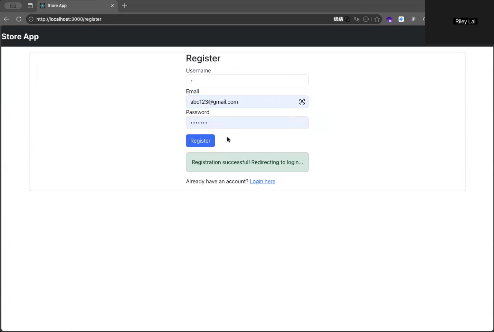


### 2. Login

Frontend login page built with React and integrated with the Store microservice’s authentication API.
Implements secure JWT-based login flow, allowing users to sign in using credentials validated by the Spring Boot backend.
Ensures stateless session handling for scalability and quick re-authentication across microservices.

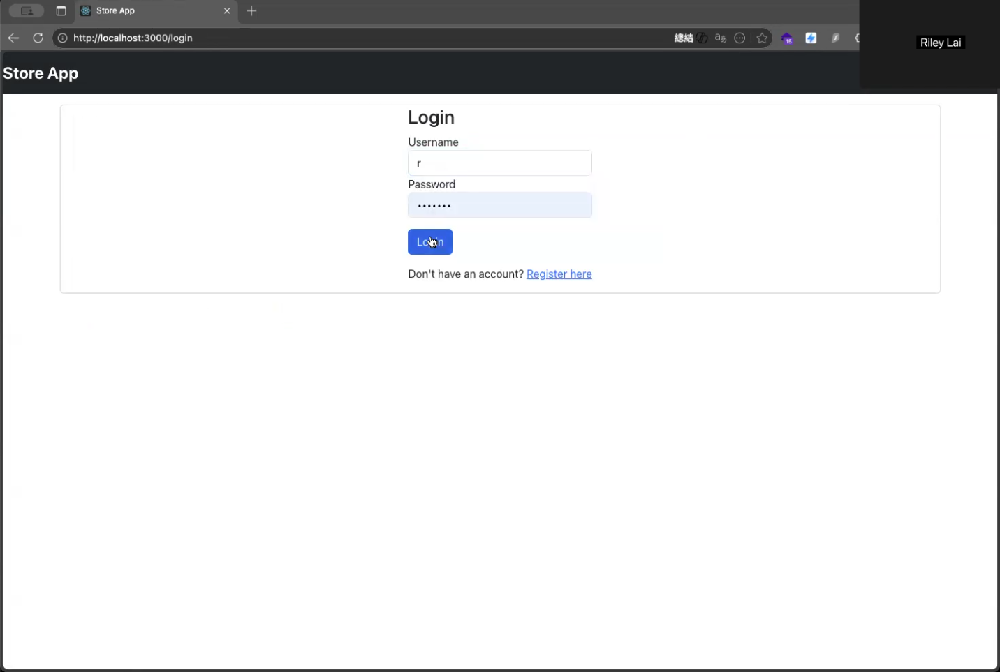


### 3. Account Balance

Displays the customer’s bank account balance retrieved from the Bank microservice.
Demonstrates real-time data synchronization through RESTful API calls, showing current balance, user ID, and account holder name.
Built with a modular React component linked to the backend via Axios, reflecting distributed system integration.

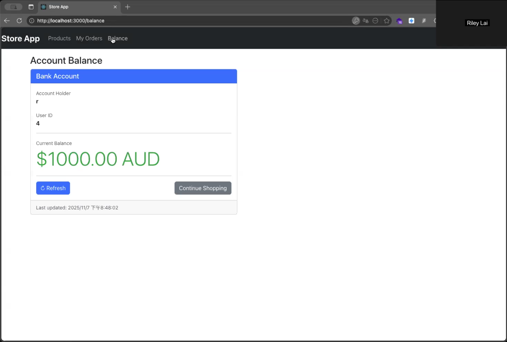


### 4. Product Dashboard

Product dashboard that lists all available items in the store, such as laptops, keyboards, and headphones.
Data is fetched from the Store microservice’s product endpoint, dynamically rendered with React hooks.
Each product card includes stock information and “Buy Now” actions, illustrating frontend-to-backend order initiation.

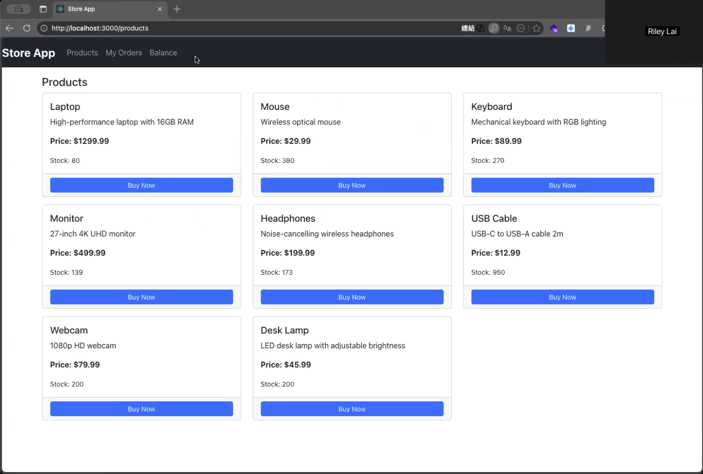


### 5. Successful Purchase Flow

#### (a) Creating Order

When a user places an order, the Store service validates stock with the Warehouse microservice before order creation.
Displays a progress modal showing “Creating Order”, part of a multi-step transactional process handled by RabbitMQ.

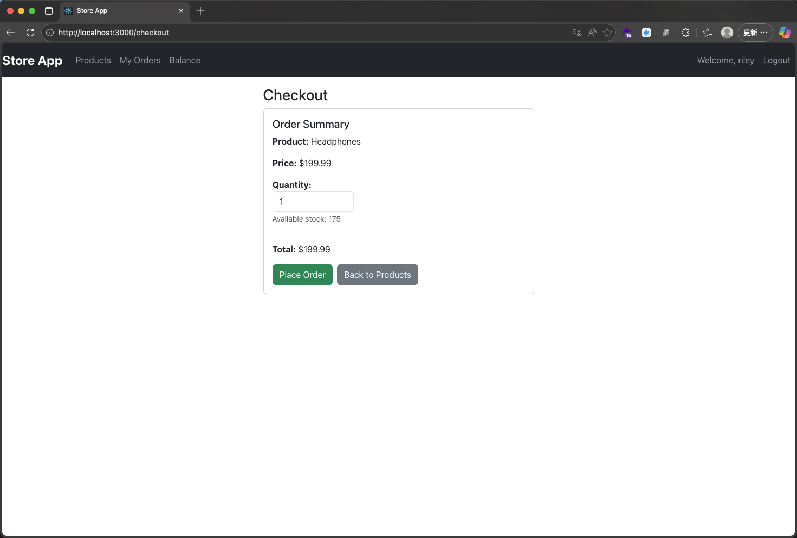
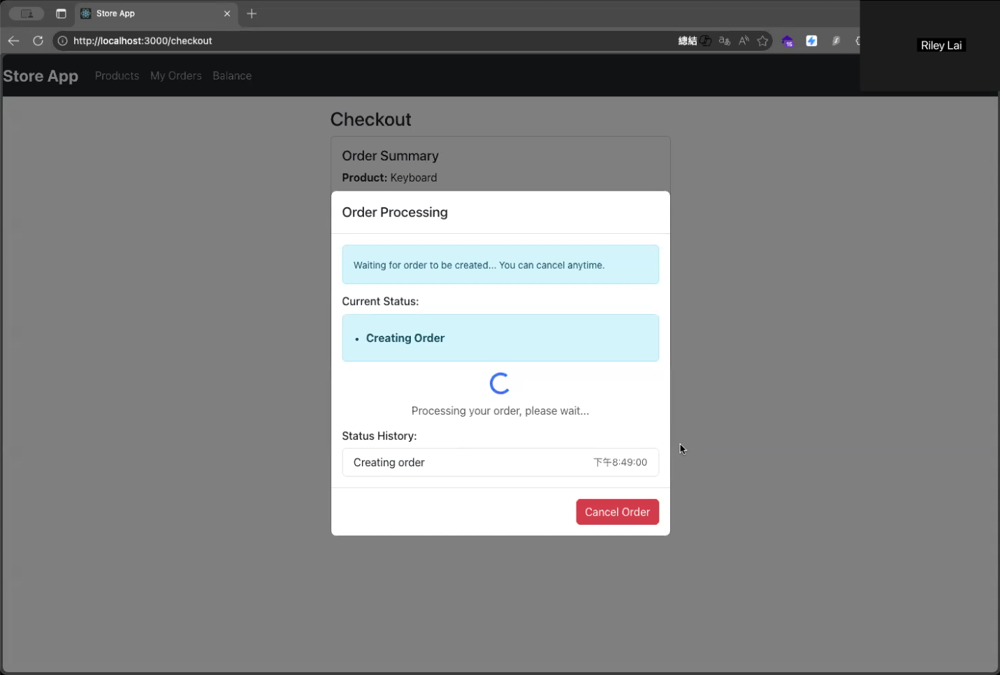

#### (b) Validating Order

The system performs order validation through synchronous REST communication with Warehouse and Bank services.
Frontend reflects real-time order state transitions through asynchronous updates.

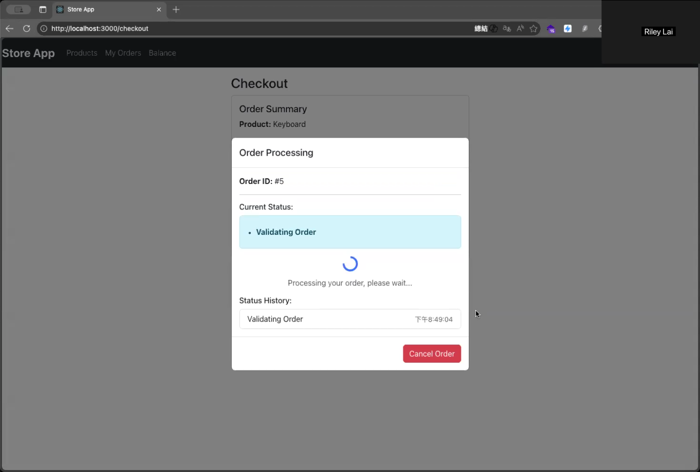

#### (c) Processing Payment

Integrates the Bank microservice for payment handling.
If payment succeeds, the system triggers a delivery request via RabbitMQ; otherwise, compensating actions initiate refunds automatically.


#### (d) Payment Successful

The frontend updates dynamically to show successful payment confirmation.
This demonstrates distributed transaction consistency achieved through event-driven communication between Store and Bank.

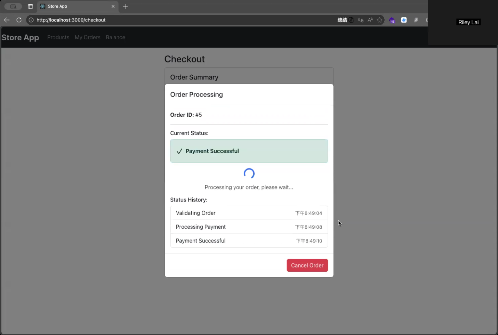

#### (e) Requesting Delivery

Store microservice publishes a delivery.request.queue message to DeliveryCo, initiating shipment.
Asynchronous messaging ensures that even under network delays, system reliability and delivery progress are preserved.

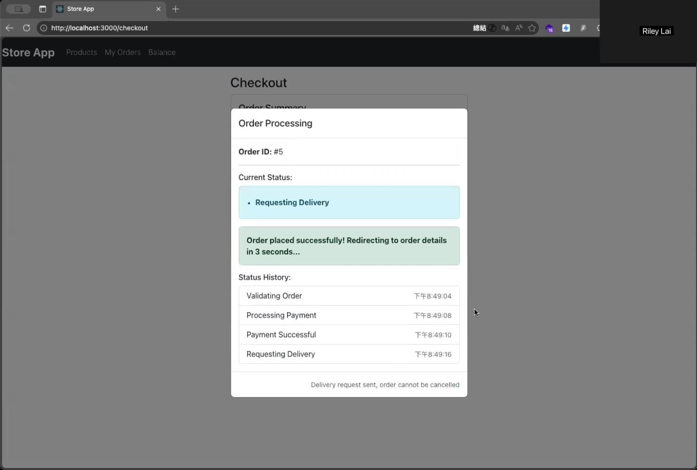

### 6. Real-Time Delivery Tracking

#### (a) Picked Up

Displays the current delivery progress once the product is picked up by the delivery partner.
Frontend retrieves the order’s live status via REST API, updated asynchronously through RabbitMQ event notifications from DeliveryCo.
This demonstrates how asynchronous event propagation keeps the frontend synchronized without constant polling.

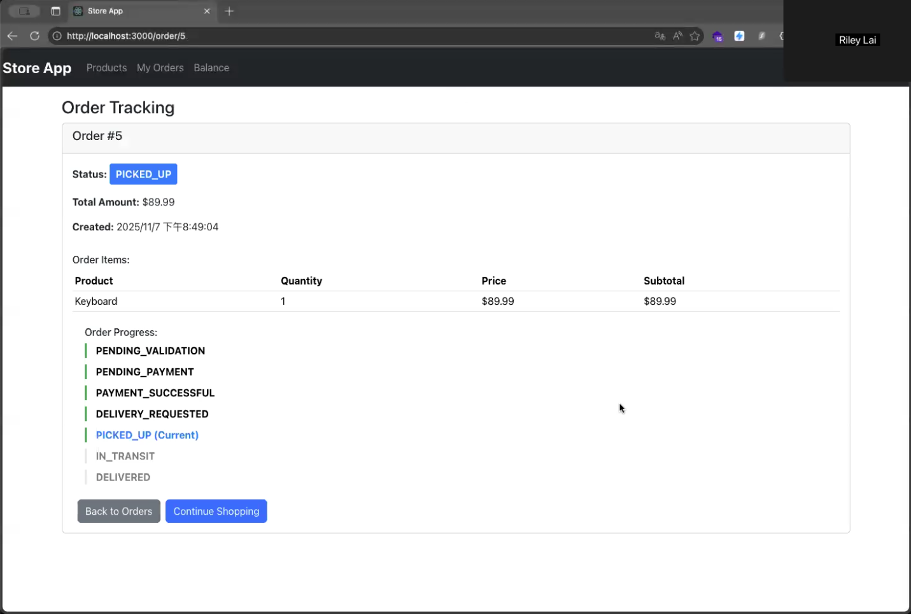

#### (b) In Transit

Order enters the IN_TRANSIT phase, reflecting updates from DeliveryCo.
This update flow confirms the resilience of the distributed system—delivery tracking events can arrive out of order but are handled idempotently in the Store service.


#### (c) Delivered

Final stage of the delivery pipeline where the product is successfully delivered to the user.
The status transitions to DELIVERED, triggering an event to EmailService, which automatically sends a delivery confirmation email.
This marks the completion of the end-to-end order lifecycle.

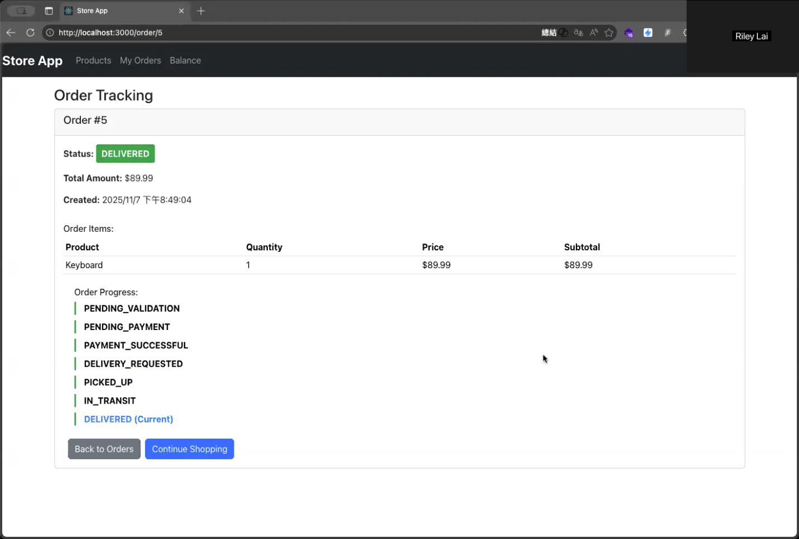

#### (d) Order Completion

Final step of the order lifecycle — the product delivery has been successfully requested and confirmed.
Highlights the complete workflow integration: Store → Bank → Warehouse → DeliveryCo → EmailService,
demonstrating the project’s resilient, event-driven microservice architecture.

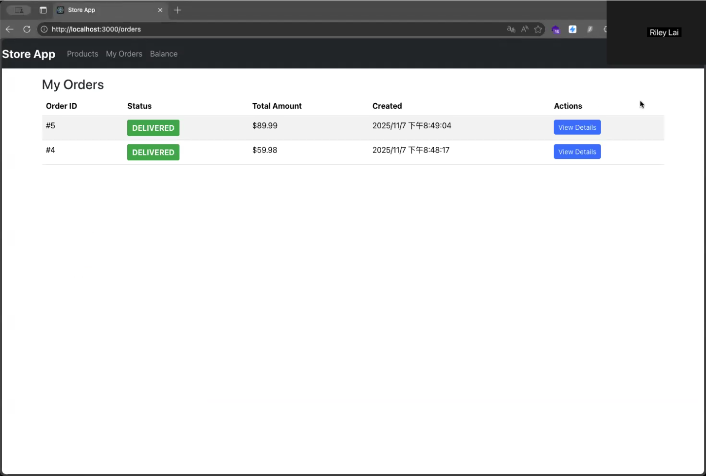

#### (e). Email Notification Logs

Backend log output from the EmailService microservice, which listens to delivery status events via RabbitMQ.
When DeliveryCo publishes order updates (PICKED_UP, IN_TRANSIT, DELIVERED), EmailService automatically sends notifications to customers through its SMTP client.
Each log entry confirms end-to-end reliability — from event publishing to email delivery — showcasing the system’s event-driven consistency and fault-tolerant design.
This final stage completes the lifecycle of a successful distributed e-commerce transaction.

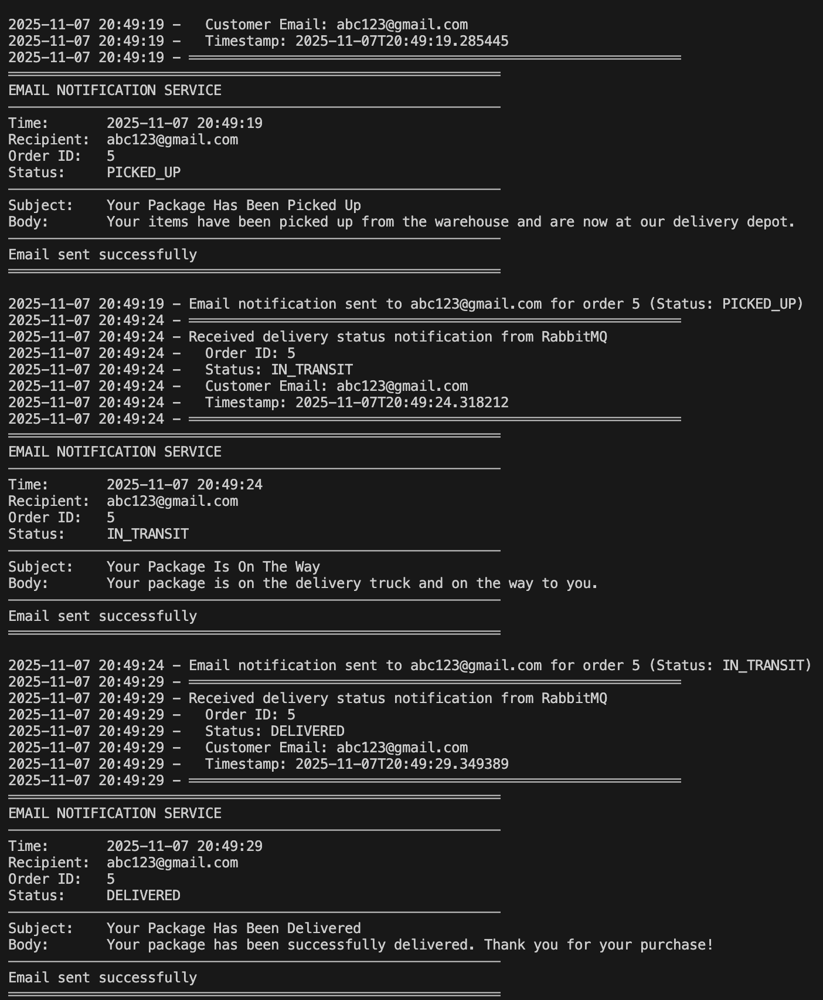

### 7. Payment Failure & Refund

If a payment fails (e.g., insufficient funds), the Store service automatically triggers a refund event to Bank and EmailService.
The refund is processed asynchronously, guaranteeing no manual intervention.
This visualizes the compensating transaction mechanism and the system’s ability to recover gracefully from errors.

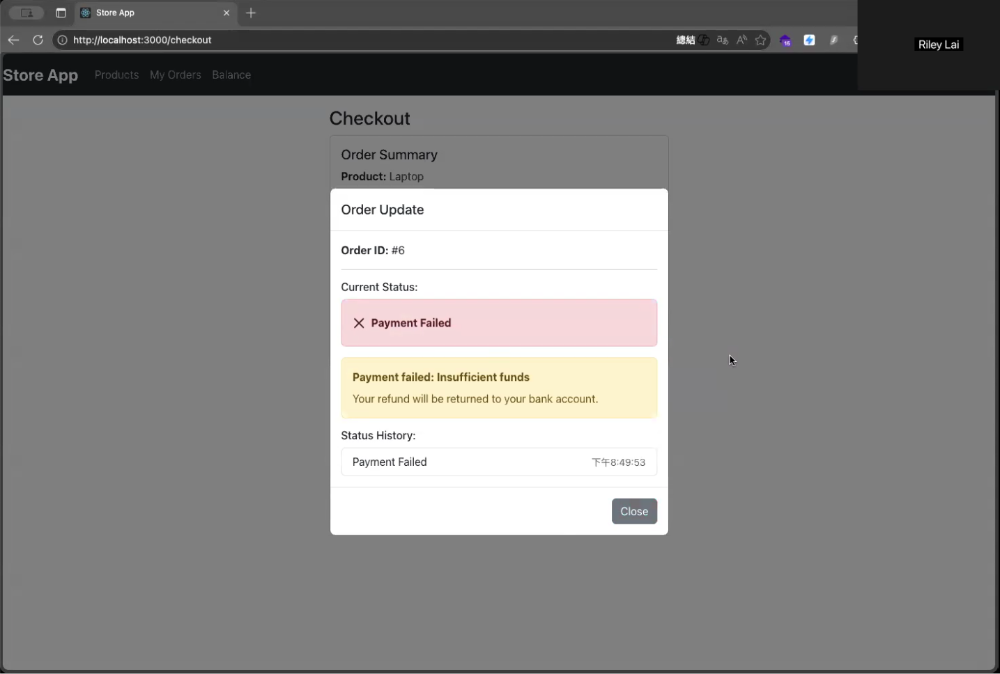


### 8. Order Cancellation

When users manually cancel an order, Store coordinates refund and stock release via Bank and Warehouse microservices.
The cancellation flow demonstrates idempotent rollback, ensuring consistency across distributed services.
Users receive real-time updates and refund confirmation within seconds.

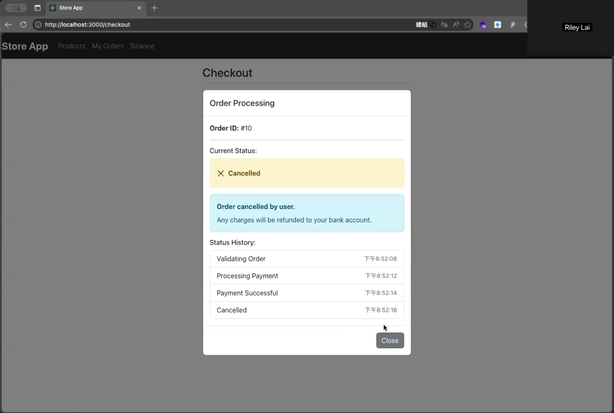

### 9. My Orders Dashboard

A unified dashboard listing all historical orders and their statuses (DELIVERED, FAILED, CANCELLED, etc.).
Data is retrieved from the Store microservice’s /orders endpoint, dynamically updated as events occur.
Demonstrates the project’s eventual consistency design and enterprise-grade visibility across the full e-commerce workflow.

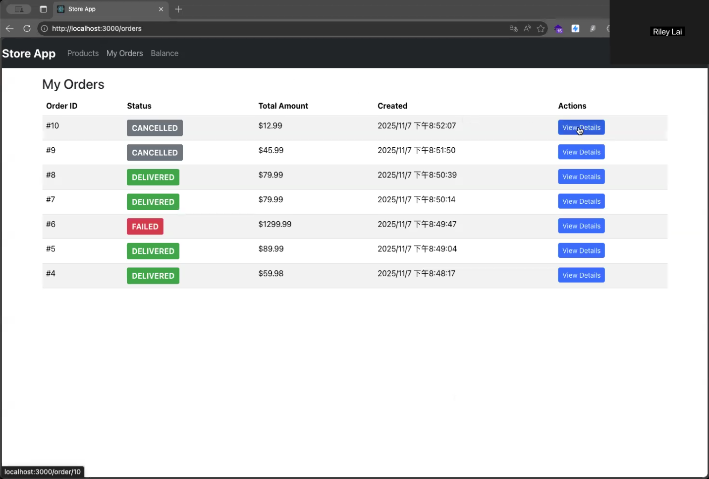

### 10. RabbitMQ Messaging Infrastructure

#### (a) Connections

All five backend microservices — Store, Bank, Warehouse, DeliveryCo, and EmailService — maintain persistent AMQP connections to the RabbitMQ broker.
Each connection represents an independent microservice client channel, ensuring message isolation and reliability.
This confirms successful multi-service connectivity and establishes the backbone of inter-service communication.

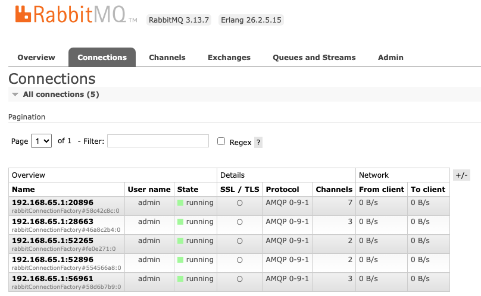

#### (b) Exchanges

The architecture uses multiple topic exchanges (order.exchange, delivery.exchange, warehouse.exchange, store.exchange) to route messages based on event type.
-	Each service publishes domain-specific events (e.g., order creation, stock update, payment result).
-	Routing keys control message flow across the distributed system, allowing selective consumption.

This design supports scalable, loosely coupled event-driven integration across services.

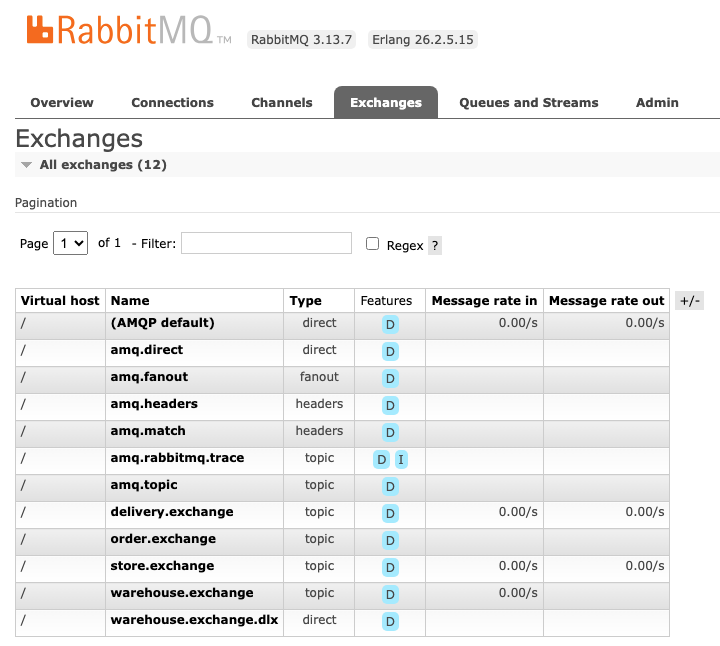

#### (c) Queues

Eleven durable queues are defined for fine-grained message routing, including:
- bank.transaction.requests and bank.events.queue for payment events
- delivery.request.queue, delivery.status.queue, delivery.email.queue for delivery tracking
- email.refund.queue and email.orderfail.queue for notification events
- Dead-letter queues (DLX) for warehouse.exchange.dlx to capture failed or expired messages

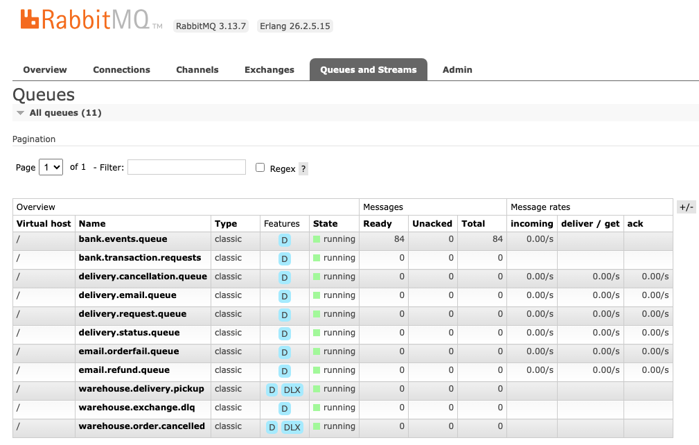

Together, these ensure fault-tolerant messaging, automatic retry via DLX, and at-least-once delivery guarantees — a hallmark of resilient, enterprise-grade distributed architectures.


